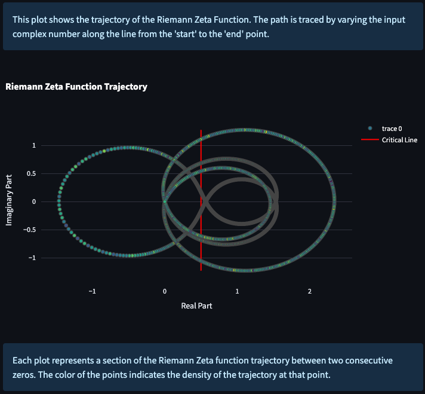

# Triadic Harmony Hypothesis: Deep Dive Into Number Theory

## Introduction

This repository is home to a collection of logical resources related to a hypothesis and related number theory research. A projected called the "Triadic Harmony Hypothesis". A exploration into unconventional use of logic and number theory. This project investigates the remarkable relationships that intertwine the Riemann Zeta Function, Bernoulli Numbers, and Pascal's Triangle and their potential implications for a deeper understanding of the Riemann Hypothesis.

## Table of Contents
1. [Introduction](#introduction)
2. [Key Concepts](#key-concepts)
   - [Riemann Zeta Function](#riemann-zeta-function)
   - [Bernoulli Numbers](#bernoulli-numbers)
   - [Pascal's Triangle](#pascals-triangle)
3. [Audio Exploration of Riemann Zeta Function](#audio-exploration-of-riemann-zeta-function)
   - [Potential Use of Audio Function](#potential-use-of-audio-function)
4. [Triadic Harmony Hypothesis](#triadic-harmony-hypothesis)
5. [Mathematical Expressions](#mathematical-expressions)
6. [Potential Implications and Future Directions](#potential-implications-and-future-directions)
7. [Conclusion](#conclusion)
8. [References](#references)
9. [Contributing](#contributing)
10. [Installation](#installation)




## Key Concepts
## Riemann Zeta Function

The Riemann Zeta function, which is denoted as $\zeta(s)$, was first introduced by Bernhard Riemann in 1859. Its series representation is given by:

$$\zeta(s) = \sum_{n=1}^{\infty} \frac{1}{n^s}$$

### Bernoulli Numbers
Bernoulli Numbers are a sequence of rational numbers with deep connections to number theory and the Riemann Zeta function. They appear in the Taylor series of many trigonometric functions, and are closely related to the Riemann Zeta function at negative integer values. The Zeta function's values at negative integers are fascinatingly connected with Bernoulli numbers. This relationship is expressed as:

$$\zeta(1 - n) = -\frac{B_n}{n}$$ 

### Pascal's Triangle
Pascal's Triangle is a triangular array of binomial coefficients, with each number being the sum of the two numbers directly above it. Apart from its prominent role in combinatorics, providing coefficients to the expansion of (a+b)^n, Pascal's Triangle also contains numerous captivating number patterns.

One such pattern within Pascal's Triangle that we will explore is the path of cumulative sums leading to the number 21, starting from the apex (the number 1 at the top) and moving downwards. The progression is as follows:

Start at the apex (1)
- Add the number from the 4th row (6), leading to a sum of 7
- Add the number from the 5th row (14), leading to a sum of 21
- Remain in the same place on the 6th row (adding 0), keeping the sum at 21
- Add the number from the 7th row (21), resulting in a final sum of 42
- This sequence of cumulative sums – 1, 7, 21, 21, 42 – represents a unique path from the apex of the triangle to the number 21.

The following illustration displays the first ten rows of Pascal's Triangle, with the numbers contributing to our sum path indicated:

---

$$
\begin{array}{ccccccccccccccccccccc}
& & & & & & & & & 1 & & & & & & & & & & \\
& & & & & & & & 1 & & 1 & & & & & & & & \\
& & & & & & & 1 & & 2 & & 1 & & & & & & \\
& & & & & & 1 & & 3 & & 3 & & 1 & & & & \\
& & & & & 1 & & 4 & & 6 & & 4 & & 1 & & & \\
& & & & 1 & & 5 & & 10 & & 10 & & 5 & & 1 & & \\
& & & 1 & & 6 & & 15 & & 20 & & 15 & & 6 & & 1 & \\
& & 1 & & 7 & & 21 & & 35 & & 35 & & 21 & & 7 & & 1 \\
& 1 & & 8 & & 28 & & 56 & & 70 & & 56 & & 28 & & 8 & & 1 \\
1 & & 9 & & 36 & & 84 & & 126 & & 126 & & 84 & & 36 & & 9 & & 1 \\
\end{array}
$$

---

Patterns such as these, while seemingly simple, may offer unexpected insights when considered in connection with other number systems or theories. This exploration is part of our ongoing investigation into the Triadic Harmony Hypothesis.

## Audio Exploration of Riemann Zeta Function

In an attempt to further understand the nuances of the Riemann Zeta Function, we've implemented a feature that allows you to listen to generative zero markers that know on the critical line. Each zero is translated into a musical tone, with the tone's frequency and duration determined by the zero's distance from the origin and the imaginary axis respectively. This audio representation provides a unique perspective to identify patterns between known zeros and explore the critical line in a more intuitive way by way of sound.

The audio generation involves the following steps:

1. The zeros of the Riemann Zeta Function are collected, and an offset can be applied to these zeros.
2. For each zero, a tone is generated with a frequency and duration determined by the zero's attributes.
3. These tones are then compiled into an audio file that you can listen to.

You can adjust various parameters such as the type of wave used for the tones (sine, triangle, sawtooth, or square), the duration factor for the tones, the offset from the defined zeros, and the play mode. The play mode provides creative options for how the tones are sequenced, including normal, reverse, random shuffle, random frequency, and random duration.

## Potential Use of Audio Function

The audio function serves as a novel approach to understand the Riemann Zeta Function. By listening to the function's zeros, we can perceive patterns or anomalies that might be difficult to identify visually. This auditory exploration provides an additional perspective to the traditional methods of mathematical analysis and could potentially reveal insights into the distribution of the zeros and the mysterious Riemann Hypothesis. Exact methods would have to be further researched but could include the use of Fourier analysis to identify patterns in the audio data.

## Triadic Harmony Hypothesis

This section provides an in-depth exploration into the Triadic Harmony Hypothesis, detailing the proposed intersections and potential relationships between the Riemann Zeta Function, Bernoulli Numbers, and Pascal's Triangle. The investigation aims to illuminate the structure of the Riemann Zeta Function and deepen our understanding of prime numbers and non-trivial zeroes. The full details can be found in the [Triadic Harmony Hypothesis](docs/triadicharmony.md)

## Mathematical Expressions

The exploration of these interconnected systems hinges on the use of mathematical expressions, particularly those involving power series. Power series serve as a cornerstone for defining these mathematical constructs.

A simple example of a power series is a geometric series, represented as:

$$
\frac{1}{1 - x} = 1 + x + x^2 + x^3 + \ldots
$$

This equation represents an infinite sum where each term is an exponentiated version of the previous term.

Interestingly, an analogy can be drawn between power series and prompt completion systems such as ChatGPT. In a power series, each successive term builds upon the last, adding new information while retaining the essence of the initial term. Similarly, in prompt completions, each subsequent response is based on the initial prompt and the preceding generated text, retaining the context while adding new content.

Therefore, a ChatGPT conversation can be viewed as a "power series" of prompts and responses, each building upon the last. The parallels between these mathematical constructs and the way language models operate illustrate the potential for mathematics to shed light on the underlying mechanics of these complex systems.

## Installation Instructions

Follow these steps to get the project up and running on your local machine:

1. **Clone the repository**

   You can clone this repository by running the following command in your terminal:
   
   ```bash
   git clone https://github.com/AdieLaine/Zeta.git

Set up a virtual environment (Optional but recommended)

It's recommended to create a virtual environment to keep the project and its dependencies isolated from your main system. You can create a virtual environment using venv module which comes installed with Python 3. Here's how to create and activate a virtual environment:

2. **Set up a virtual environment** (Optional but recommended)

   It's recommended to create a virtual environment to keep the project and its dependencies isolated from your main system. You can create a virtual environment using `venv` module which comes installed with Python 3. Here's how to create and activate a virtual environment:

   On macOS and Linux:
   ```bash
   python3 -m venv env
   source env/bin/activate
   ```

On Windows:

```bash
py -m venv env
.\env\Scripts\activate
```

Install the required packages**
```bash
pip install -r requirements.txt
```

Run the project

You can run the project with the following command:
```bash
streamlit run src/zeta.py
```

## Potential Implications and Future Directions
This section speculates on potential implications of the Triadic Harmony hypothesis and suggests future directions for research.

## References
The references section houses the relevant literature and sources that supplement our understanding and exploration of the Triadic Harmony hypothesis.

## Contributing
We welcome and encourage contributions to this project! Whether you have a mathematical insight, an interesting resource, or a constructive critique, your input is valued. This is an exciting journey into the heart of number theory, and we invite you to join us in the exploration. Your curiosity, passion for mathematics, and willingness to challenge assumptions will help drive this investigation and enrich our collective understanding of these fascinating interconnections.
